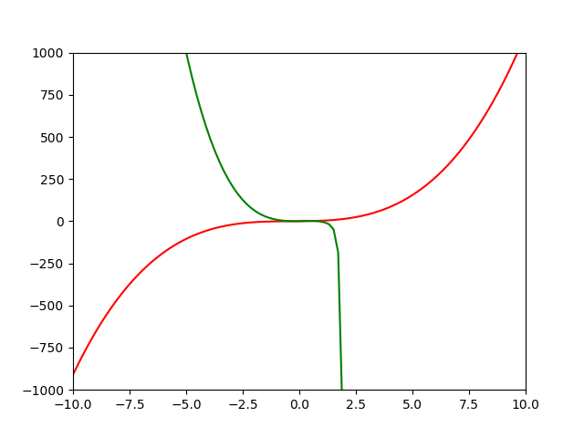

# Fast Symbolic Regression

fastsr is a symbolic regression package built on top of [fastgp](https://github.com/cfusting/fastgp), a numpy implementation of [genetic programming](https://en.wikipedia.org/wiki/Genetic_programming) built on top of [deap](https://github.com/DEAP/deap).
fastsr estimators adhere to the [sklearn](http://scikit-learn.org/stable/) estimator interface and can thus be used in pipelines.

fastsr was designed and developed by the [Morphology, Evolution & Cognition Laboratory](http://www.meclab.org/) at the University of Vermont. It extends research code which can be found [here](https://github.com/mszubert/gecco_2016).

Installation
------------
fastsr is compatible with Python 2.7+.
```bash
pip install fastsr
```

Example Usage<a name="ex"></a>
------------------------------
[Symbolic Regression](https://en.wikipedia.org/wiki/Symbolic_regression) is really good at fitting nonlinear functions. Let's try to fit the third order polynomial x^3 + x^2 + x. This is the "regression" example from the examples folder.
```python
import matplotlib.pyplot as plt

import numpy as np

from fastsr.estimators.symbolic_regression import SymbolicRegression

from fastgp.algorithms.fast_evaluate import fast_numpy_evaluate
from fastgp.parametrized.simple_parametrized_terminals import get_node_semantics
```
```python
def target(x):
    return x**3 + x**2 + x
```
Now we'll generate some data on the domain \[-10, 10\].
```python
X = np.linspace(-10, 10, 100, endpoint=True)
y = target(X)
```
Finally we'll create and fit the Symbolic Regression estimator and check the score.
```python
sr = SymbolicRegression(seed=72066)
sr.fit(X, y)
score = sr.score(X, y)
```
```
Score: 0.0
```
Whoa! That's not much error. Don't get too used to scores like that though, real data sets aren't usually as simple as a third order polynomial.

fastsr uses Genetic Programming to fit the data. That means equations are evolving to fit the data better and better each generation. Let's have a look at the best individuals and their respective scores.
```python
print('Best Individuals:')
sr.print_best_individuals()
```
```
Best Individuals:
0.0 : add(add(square(X0), cube(X0)), X0)
34.006734006733936 : add(square(X0), cube(X0))
2081.346746380927 : add(cube(X0), X0)
2115.3534803876605 : cube(X0)
137605.24466869785 : add(add(X0, add(X0, X0)), add(X0, X0))
141529.89102341252 : add(add(X0, X0), add(X0, X0))
145522.55084614072 : add(add(X0, X0), X0)
149583.22413688237 : add(X0, X0)
151203.96034032793 : numpy_protected_sqrt(cube(numpy_protected_log_abs(exp(X0))))
151203.96034032793 : cube(numpy_protected_sqrt(X0))
153711.91089563753 : numpy_protected_log_abs(exp(X0))
153711.91089563753 : X0
155827.26437602515 : square(X0)
156037.81673350732 : add(numpy_protected_sqrt(X0), cbrt(X0))
157192.02956807753 : numpy_protected_sqrt(exp(cbrt(X0)))
```
At the top we find our best individual, which is exactly the third order polynomial we defined our target function to be. You might be confused as to why we consider all these other individuals, some with very large errors be be "best".
We can look through the history object to see some of the equations that led up to our winning model by ordering by error.
```python
history = sr.history_
population = list(filter(lambda x: hasattr(x, 'error'), list(sr.history_.genealogy_history.values())))
population.sort(key=lambda x: x.error, reverse=True)
```
Let's get a sample of the unique solutions. There are quite a few so the print statements have been omitted.
```python
X = X.reshape((len(X), 1))
i = 1
previous_errror = population[0]
unique_individuals = []
while i < len(population):
    ind = population[i]
    if ind.error != previous_errror:
        print(str(i) + ' | ' + str(ind.error) + ' | ' + str(ind))
        unique_individuals.append(ind)
    previous_errror = ind.error
    i += 1

```
Now we can plot the equations over the target functions.
```python
def plot(index):
    plt.plot(X, y, 'r')
    plt.axis([-10, 10, -1000, 1000])
    y_hat = fast_numpy_evaluate(unique_individuals[index], sr.pset_.context, X, get_node_semantics)
    plt.plot(X, y_hat, 'g')
    plt.savefig(str(i) + 'ind.png')
    plt.gcf().clear()

i = 0
while i < len(unique_individuals):
    plot(i)
    i += 10
i = len(unique_individuals) - 1
plot(i)
```
Stitched together into a gif we get a view into the evolutionary process.



Fitness Age Size Complexity Pareto Optimization
-----------------------------------------------
In addition to minimizing the error when creating an interpretable model it's often useful to minimize the size of the equations and their complexity (as defined by the order of an approximating polynomial<a href="#lc-1">\[1\]</a>). In [Multi-Objective optimization](https://en.wikipedia.org/wiki/Multi-objective_optimization) we keep all individuals that are not dominated by any other individuals and call this group the Pareto Front. These are the individuals printed in the <a href="#ex">Example Usage</a> above. The age component helps prevent the population of equations from falling into a local optimum and was introduced in AFPO <a href="#lc-2">\[2\]<a> but is out of the scope of this readme.

The result of this optimization technique is that a range of solutions are considered "best" individuals. Although in practice you will probably be interested in the top or several top individuals, be aware that the population as a whole was pressured into keeping individual equations as simple as possible in addition to keeping error as low as possible.

Literature Cited
----------------
1. Ekaterina J Vladislavleva, Guido F Smits, and Dick Den Hertog. 2009. Order of nonlinearity as a complexity measure for models generated by symbolic regression via pareto genetic programming. IEEE Transactions on Evolutionary Computation 13, 2 (2009), 333–349.<a name="lc-1"></a>
2. Michael Schmidt and Hod Lipson. 2011. Age-fitness pareto optimization. In Genetic Programming Theory and Practice VIII. Springer, 129–146.<a name="lc-2"></a>
